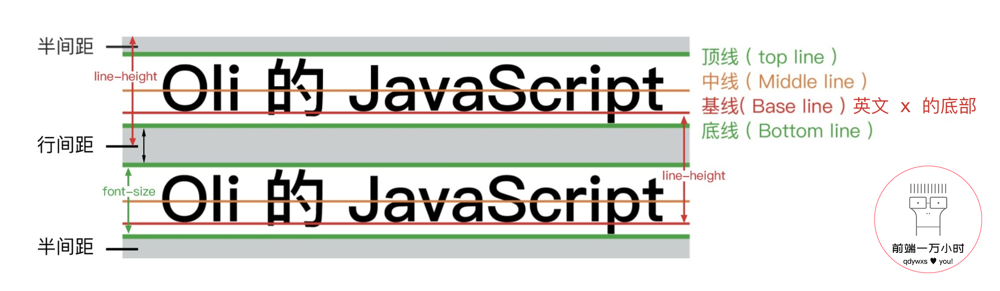

## 初识CSS

### 在HTML文件中引入CSS的方式
#### 外部引用  
+ 通过 ```<link>``` 元素链接到CSS文件。如：  
    ```<link rel="stylesheet" herf="default.css" type="text/css">```
+ 通过在样式文件或 ```<style>``` 元素中使用 ```@import``` 引入CSS文件。如：
    ```css
    <style>
    @import url("default.css");
    @import url(default.css);
    @import "defaule.css";
    @import url(default.css) screen and (orientation:landscape|portrait);/*条件引用，有屏幕，且规定屏幕方向*/
    </style>
    ```
    `@import`结尾必须有分号。
#### 内部样式  
+ 在 ```<head>``` 元素内，添加 ```<style>``` 元素，在其中编写当前HTML文件的样式。  
#### 内联样式  
+ 在元素的开始标签中添加 __style__ 属性，在这属性中编写这一元素的CSS样式。  

### CSS语法结构
>   
> 注：值为 0 时，除%号外，不用写单位，如'px'等。值为多个单词时需要用引号引用。  
  
### @charset 的作用
+ `@charset` 设置样式表文件使用的字符编码。它必须在最开始处设置，且前面不能有任何字符。
+ `@chaeset` 在设置一些非ASCII码的值时非常有用。如 content,font-family,注释。

### CSS选择器 [参考](https://www.w3school.com.cn/cssref/css_selectors.asp) 

+ 通用选择器: `*` 选择页面的所有元素。
+ 标签选择器:如 `div` 选择所有的 div 标签元素。
+ ID选择器: `#idString` 选择一个元素。一个页面的ID必定是唯一的，一个元素也只能有一个 ID。
+ 类选择器: `.classString` 选择一类元素。一个元素可以有多个类。
+ 属性选择器: `[attt]` 选择有这个属性的所有元素。
+ 属性值选择器: `[attr=val]` 选择有这个属性，且属性值也匹配的所有元素。
+ 属性值复杂选择器：
  - 属性值开始字符选择器: `[attr^=val]` 选择属性值以 val 字符开头的所有元素。
  - 属性值开始单词选择器: `[attr|=val]` 选择属性值以 `-` 分割的单词，val 开头的所有元素。
  - 属性值结尾字符选择器: `[attr$=val]` 选择属性值以 val 字符结尾的所有元素。
  - 属性值包含字符选择器: `[attr*=val]` 选择属性值包含 val 字符的所有元素。
  - 属性值包含单词选择器: `[attr~=val]` 选择属性值包含以 ` [space]` 分割的单词 val 的所有元素。
+ 组合选择器
  - 多元素选择器: `,` 选择符合以 `,` 分割的多个选择器的所有元素。
  - 子代选择器: `>` 选择符合前一个选择器所有直接子代(儿子)中的符合后一个选择器的元素。
  - 后代选择器: ` [space]` 选择符合前一个选择器中的所有后代(子孙)符合后一个选择器的元素。
  - 直接相邻元素选择器: `+` 选择同级(同一个父元素)中符合前一个选择器的直接相邻的符合后一个选择器的所有元素。
  - 兄弟选择器: `~` 选择同级(同一个父元素)中符合前一个选择器的所有符合后一个选择器的元素。
+ 伪类选择器
  - 静态伪类选择器 `:link` `:visited`
  - 动态伪类选择器 `:focus` `:hover` `:active`
  - 操作伪类选择器 `:checked` `:enabled` `:disabled`  `:read-only` `:read-write` `::selection`
  - 结构伪类选择器 
    1. `:first-child` `:last-child` `:only-child` `:nth-child(n)`
    2. `:first-of-type` `:last-of-type` `:only-of-type`  `:nth-of-type(n)`
    3. `:root` `:not()` `:empty` `:target`

### CSS样式应用规则
+ 继承：子元素可以从父元素继承部分样式。如 字体外观 都能继承，而 盒框模型 都不能继承。
+ 层叠：就近原则，同一元素的同一属性声明，离元素越近的会覆盖离元素远的值。
+ 权重：!important > 内联 > id > class > 伪类 > 标签 > 通用 `*` > 默认  。最后属性生效的值是取权重最高的，如果权重一样，参考就近原则。

### CSS的值
+ 类别：[number] [length] [keywords] [function] [expression] [color]
+ 单位：
  - 相对长度单位：px em rem ex
  - 相对视口单位：vw vh vmin vmax

### 背景样式[background]
+ CSS2
  - background-color:[color];
    + 父项应用背景色，子项应用边框圆角时，会出现背景色溢出圆角。应将背景色也应用到子项。
  - background-img:url();
    + 多个背景图用分号;隔开
  - background-repeat:no-repeat|repeat-x|repeat-y|repeat|space|round;
    + 两个值表示 水平 垂直
    + 多个背景图用分号;隔开
  - background-position:[keyword]top|right|bottom|left|center|[number]|[length]
    + 多个背景图用逗号,隔开
  - background-attachment:scroll|fixed|local
    + 多个背景图用逗号,隔开
+ CSS3
  - background-clip:border-box|padding-box|content-box|text;
  - background-origin:border-box|padding-box|content-box;
    + 背景图片左上角绘制起点
  - background-size:[keyword]auto|contain|cover|[number]|[length]
    + 两个值时表示 水平 垂直
  
### 字体[font]
+ 类别：Serif 衬线体，Sans-Serif 无衬线体，Monospace 等宽体，Cursive 手写体，Fantasy 艺术体
+ font-style:normal|italic|oblique
  - italic和oblique都是斜体区别是，italic是用该字体的斜体版，oblique是将字体倾斜(即使没有斜体版)；
+ font-variant:normal|small-caps;
  - 文本字体变形,normal 普通,small-caps 小型大写字母。
+ font-weight:normal|lighter|light|bold|bolder;
+ font-size:[length]
  - IE8不支持em
+ font-family:Times,Georgia,'Segoe UI','\5FAE\8F6F\96C5\9ED1';
  - 设置备选字体用逗号,隔开
  - 多单词字体用单引号'引起
  - 中文字体名可用unicode编码,`escape()`
+ font:font-style font-variant font-weight font-size/line-height font-family;
  - font-size 和 font-family 必须有。
  - font-size 和 line-height 自己用 `/` 隔开。

### 列表[ul,ol,dl]
+ list-style-type:disc|circle|square|decimal|...[参考](https://developer.mozilla.org/zh-CN/docs/Web/CSS/list-style-type)
+ list-style-image:none|url();
+ list-style-position:outside|inside;
+ list-style:list-style-type|list-style-image|list-style-position;

### 表格[table]
+ caption-side:top|bomtton;
+ table-layout:auto|fixed;
  - 表格宽度计算方法，auto按内容，fixed按第一行。
+ border-spacing:[length]|[length] [length];
  - 两个值时表示水平 垂直；
+ empty-cells:hide|show;
+ border-collapse:separate|collapse;
  - 当 `border-collapse:collapse;` 时此属性会覆盖 border-spacing,效果同 0;empty-cells,效果同 show;border-radius,效果同none;并使tr的边框生效，否则tr的边框会以th/td的为准。

### 文本[text]
+ 自身样式
  - color:[color];
  - text-transform:none|capitalize|uppercase|lowercase;
  - text-decoraction-line:overline|line-through|underline;
  - text-decoraction-color:[color];
  - text-decoraction-style:solid|dotted|wavy;
  - text-decretion:text-decoraction-line|text-decoraction-color|text-decoraction-style;
    + 三色一线一样
  - text-shadow:x y blur color;
    + 多个阴影用,隔开；
+ 段落布局
  - text-indent:[length];首行缩进
  - letter-spacing:[length];字符间距
  - word-spacing:[length];词间距
  - line-height:[length]|[number];行高,[number]类型时为font-size的倍数,推荐 1.5-2;
  - text-algin:start|left|center|justify|right|end;文本水平对齐;
  - derection:ltr|rtl;文本水平(对其)方向
  - writing-mode:horizontal-tb|vertical-lr|vertical-rl;多行文本书写方向;
  - white-space:pre|pre-wrap|pre-line|nowrap|normal;处理空白符与换行制表符;
  - text-overflow:clip|ellipsis;不换行时溢出处理;
  - word-wrap|overflow-wrap:normal|break-word|anywhere;长不可分割单词强制折断处理;
  - word-break:normal|break-all|keep-all|break-word;
    + normal CJK折行,非CJK长单词溢出
    + break-all 全部折断
    + keep-all 全部不折断包括CJK
    + break-word CJK折行，非CJK长单词折行,等效于 word-break:normal;overflow-wrap:break-word;
  - line-break:auto|loose|normal|strict|anywhere;

### 盒模型[Box]
#### 理解
  + 一个完整的盒模型由外到内:outline margin border padding content;
  + 盒子的布局主要受 盒子的尺寸，盒子的类型，定位方案，相邻盒子，视口，内容等影响。
  + 盒子的类型由 `display` 决定。
  + 视觉格式化模型[visual formatting model]会根据盒子的“包含块”的边界来渲染盒子，处理盒子的摆放布局。
  + 正常流：元素从上到下从左到右排列显示。
  + 块级元素与块级盒子
    - 设置 `display` 为 `block|table|list-item` 等时元素会变为块级元素。
    - 块级元素会被格式化为一个块，前后自动生成换行，使其独占一行，从上到下垂直排列。
    - 块级元素都至少生成一个块级盒子，而 块级盒子 才会参与 “块级格式化上下文”[block formatting context] 的创建。
  + 行内元素与行内盒子
    - 设置 `display` 为 `inline-block|inline-table|inline` 等时元素会变为行内元素。
    - 行内元素，前后不会自动换行，而是从左往右流动摆放，一般是块级元素的子项。
    - 行内元素会生成行内盒子，参与 “行内格式化上下文”[inline formatting context] 的创建。
  + 不同类型盒子的格式化方式的异同
    - 块盒子水平格式化：
      + 块盒子的水平=父元素的 `widht=margin-left+border-left+padding-left+content-width+padding-right+border-right+margin-right`;
      + 其中只有 `width margin-left margin-right` 的值可以为 `auto`,其余的值要么为确定的[length]要么默认 0。 

      情况|说明  
      --|--  
      三个都不为 auto|格式化属性过分受限，强制 `margin-right:auto;`使其适应父元素的宽。
      一个是 auto|是 auto 的属性自动适应父元素的宽。
      两个是 auto|width不是auto,margin-left,margin-right是auto,元素水平居中；width是auto,任意一margin不是auto,margin是auto的强制为 0，使其width自动适应父元素的宽。
      三个都是 auto|将两个margin改为 0，使 width 适应父元素的宽。
    - 块盒子的垂直格式化
      + 块盒子的的水平=父元素的`height=margin-top+border-top+padding-top+content-height+padding-bottom+border-bottom+margin-bottom`;
      + 其中只有 `height margin-top margin-bottom` 的只可以为 `auto`，其余的值要么为确定的[length]要么默认0。且设置 `margin-top margin-bottom` 为 `auto` 无效。都会重置为 0,因此不能通过设置垂直方向的 `margin-top margin-bottom` 为 `auto` 来垂直居中元素是不可能的。
    - 外边距的合并
      + 当多个元素相邻或包含时，其垂直方向的外边距 `margin` 会合并为一个，水平方向不合并。
      + 一个空元素，只存在外边距时，它的上下外边距会合并为一个。
      + 合并方式：如果有 __两个负 `margin`__ 时，合并为绝对值最大的那个；如果有 __一正一负 `margin`__ 时，取值用正减去(负的绝对值)，__两个都是正的__ 参考块盒子的垂直格式化，外边距合并取最大值。
    - 负 `margin`
      + 块盒子的水平之和为父元素的 `width` ，当有 __负 `margin`__ 存在时，可能会引起块元素的 `width:auto` 变得大于父元素的 `width` ，具体计算先参考块盒子的水平格式化说明，替换后在计算后面的 `auto` 值。
      + 块盒子的垂直方向的外边距会影响元素的位置，`margin-top` 为负值时，块盒子自身及其后面的元素均会上移，`margin-bottom` 为负值时，块盒子下面的元素会上移。
    - 行内盒子概念：
      + 匿名文本：没有包含在行内元素中的文本。
      + 非替换元素：包含元素本身的文本包含在元素结构之内。
      + 替换元素：用其他内容替换元素结构，如 `img input` 。
      + 文本行：  
    - 行内盒子格式化
      + `line-height` 有继承性。
      + `vertical-algin` 只能用于行内元素和替换元素，没有继承性。
      + `vertical-algin` [取值](https://www.yuque.com/olizhao/qdywxs/css_08#81a32804)
    - 理解
      + `line-height:2;` 与 `line-height:200%;`的区别：它们都表示行高取字体的2倍。但是当他们用在父元素，且子元素字体大小不一致时，就出现差异。由于继承性，子元素会继承父元素的 `line-height:2;` ，那么子元素行高会因为字体大小不同而不一致 __行高不统一__ ；而当父元素 `line-height:200%;` 时会先将其换算为具体的值 如 16px*200%=32px ，子元素再继承 32px ，因此子元素行高会一致， __行高统一__ 。
      + 行内盒子的边框，边界是由 font-size 和 height 控制的，而不是 line-height 。
      + line-height = height 可以用来居中 __单行__ 文本。
      + inline-block 的特点：既呈现 inline 的特点(不占据一整行，宽度由内容决定)，又呈现 block 的特点(可以设置宽高和内外边距)。
      + inline-block 的作用、副作用和解决办法：当要横向并列暂时一些内容(如导航条，按钮组)时，除了浮动，还可以将元素设置 `display:inline-block;` ；副作用，由于标签之间有换行等符号会被合并为一个空格导致元素之间有空隙；解决办法1，去除文件标签间的其他符号，解决办法2，先将父元素的字体大小设为0，在将元素的大小改为合适的大小。

### 其他注意要点
+ 在设置页面字体时，严格要求在`font-family`最后添加上一种或多种通用字体类别，使用户客户端在无指定的字体时，也以一种通用的字体类别显示。
+ 段落样式中，行高`line-height`最好在1.5~2倍之间。
+ 背景色溢出圆角问题：父项设置圆角，子项设置背景色，可能会溢出。
+ CSS3 选择器：IE8仅支持 General siblings (element1~element2) and Attribute selectors [attr^=val], [attr$=val], and [attr*=val]。IE9=+支持全部。
+ `:first-of-type`选中的一定是在某一类标签中选择合适前面条件的元素，如`.btn:first-of-type`会先将子元素分为几类，再在每一类中选第一个元素，接着在选择的元素中再选择有`.btn`的，始终理解CSS选择器的匹配是从右往左，从子到父。
+ CSS3 圆角`border-radius`：IE9=+支持。
+ 表格行间隔背景色用`:nth-child(odd|even)`实现。
+ 如果要对表格应用圆角`border-radius`，则需要表格设置`border-collapse:separate;`及在单元格上应用边框`border`和背景色`background-color`，否则可能会出现圆角失效，或者背景色溢出等问题。
+ 用`border`绘制三角形时，`border-width`的值为三角形的高。
+ 可用`<a>`来代替`<botton>`,`<button>`设置`display:inline-block;`时，鼠标指针会变为文本，需要重新设置`cursor:pointer;` 。
+ 让元素透明，IE8用：`filter:alpha(opacity=0~100);` ，其他用 `opacity:0~1;` 。
+ 让元素不可见的方法：`display:none;` , `visibility:hidden;` , `opacity:0;` 。